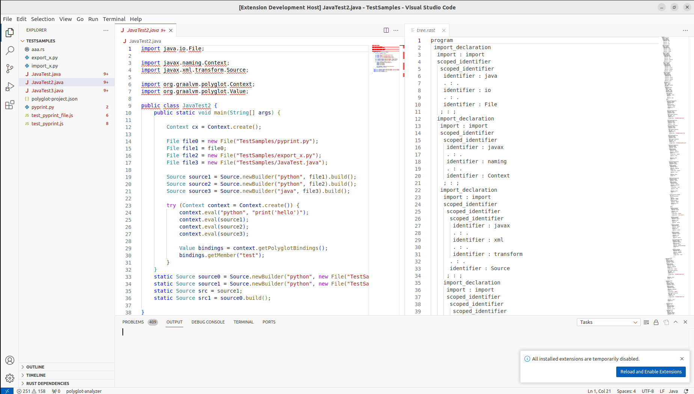

## Polyglot LSP
Polyglot LSP in rust under development

## 💻 Presentation

**Rust implementation of a polyglot (cross-language) Visual Studio Code extension**

This project is a work in progress. It is a Rust implementation of a polyglot (cross-language) Visual Studio Code extension. It is based on the [Language Server Protocol](https://microsoft.github.io/language-server-protocol/) (LSP) and [Tree-sitter](https://tree-sitter.github.io/tree-sitter/) library.
It currently supports Java and partially supports JavaScript and Python.
Today, it is possible to use the extension to get the polyglot concrete syntax tree of a polyglot program.
Other polyglot analysis features are under development.

## 📝 Running the extension

PolyglotLSP is not yet published on the Visual Studio Code marketplace. To run the extension, you need to :
- **Clone** this repository : `https://github.com/bsauvat/polyglot-lsp.git`
- go to **Run and Debug** section in Visual Studio Code and choose the **Run Extension (Debug Build)** configuration
- wait for a few seconds / minutes for the extension to compile
- wait for the extension polyglot-analyzer to be launched in a new Visual Studio Code window
- open a polyglot program (e.g. `examples/polyglot.java`) with the extension
- with the extension, **open the command palette (Ctrl+Shift+P) or F1**, type and select **'Show Syntax Tree'**

And then a half window will appear on the right side of the screen with the polyglot concrete syntax tree of the program.

## 📌 Example of PolyglotLSP extension

Here is an example of the extension with a polyglot Java program :

The extension displays the polyglotAST of JavaTest2.java on the right side of the screen in the window 'tree.rast'

